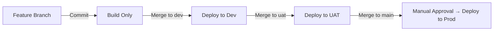

# React + TypeScript + Vite UI on AKS via GitLab CI/CD

Production-ready skeleton for a **React + TypeScript + Vite** frontend deployed to **Azure Kubernetes Service (AKS)** with **GitLab CI/CD** across **Dev / UAT / Prod** namespaces.

---

## 📂 Final Project Folder Structure
```bash
react-ui-vite-app-aks(uK8s)/
├── .gitlab-ci.yml                # GitLab pipeline (build + deploy Dev/UAT/Prod)
├── Dockerfile                    # Multi-stage Docker build (Vite → Nginx)
├── nginx.conf                    # Nginx config (SPA fallback + caching)
├── package.json                  # React + Vite dependencies
├── tsconfig.json                 # TypeScript config
├── vite.config.ts                # Vite config
├── index.html                    # Entry HTML
├── src/                          # React UI source code
│   ├── App.tsx
│   └── main.tsx
├── .env.development              # Dev environment config
├── .env.uat                      # UAT environment config
├── .env.production               # Prod environment config
│
├── k8s/                          # Kubernetes manifests
│   ├── base/                     # Base manifests
│   │   ├── deployment.yaml
│   │   ├── service.yaml
│   │   └── ingress.yaml
│   ├── dev/                      # Dev overlay (kustomize)
│   │   └── kustomization.yaml
│   ├── uat/                      # UAT overlay
│   │   └── kustomization.yaml
│   ├── prod/                     # Prod overlay
│   │   └── kustomization.yaml
│   ├── namespaces/               # Namespace definitions
│   │   ├── namespace-dev.yaml
│   │   ├── namespace-uat.yaml
│   │   └── namespace-prod.yaml
│   └── rbac/                     # Optional RBAC (scoped GitLab deployer)
│       ├── gitlab-deployer-dev.yaml
│       ├── gitlab-deployer-uat.yaml
│       └── gitlab-deployer-prod.yaml
│
├── docs/                         # Documentation folder
│   ├── README.md                 # Project guide (setup, CI/CD flow, etc.)
│   ├── MVP_SETUP.md              # Checklist for Phase 1 setup
│   ├── KUBECTL-COMMANDS.md       # Useful kubectl commands for AKS
│   ├── TROUBLESHOOTING.md        # Placeholder for issues & fixes (TODO)
│   └── ROADMAP.md                # Phase 2+ improvements roadmap (TODO)
│
└── README.md                     # Short pointer (redirects to docs/README.md)
```

## 🔹 Features
- Dev/UAT/Prod deployments via GitLab CI/CD  
  - Dev & UAT → auto after MR merge  
  - Prod → requires manual approval  
- Environment configs via `.env.development`, `.env.uat`, `.env.production` (`VITE_` prefix)  
- Kustomize overlays per environment (namespace, host, image tag)  
- Dockerized static site served by Nginx  
- Optional scoped RBAC for GitLab deployer  
- Clear roadmap for Phase 2+ (TLS, ConfigMaps, Helm, monitoring)

---

## 🔹 Prerequisites
Ensure the following tools are installed locally (for testing/building):
- [Node.js](https://nodejs.org/) (>=18.x) & npm
- [Docker](https://docs.docker.com/get-docker/)
- [kubectl](https://kubernetes.io/docs/tasks/tools/)
- [kustomize](https://kubectl.docs.kubernetes.io/installation/kustomize/)
- Access to an **Azure AKS cluster** & **Azure Container Registry (ACR)**
- A GitLab repository

---

## 🔹 CI/CD Pipeline Flow



---

## 🔹 Local Development

Run the app locally using Vite dev server:

```bash
npm install
npm run dev       # start dev server at http://localhost:5173
npm run build     # build production bundle to /dist
npm run preview   # preview production build locally
```

Or build & run inside Docker:

```bash
docker build --build-arg ENV=development -t react-ui:local .
docker run -p 8080:80 react-ui:local
```

---

## 🔹 Environment Variables (Vite)

Environment-specific files at repo root:
```
.env.development
.env.uat
.env.production
```

All variables **must be prefixed with `VITE_`** to be accessible in React.

Example `.env.uat`:
```env
VITE_API_URL=https://uat-api.mycompany.com
VITE_ENV=uat
```

---

## 🔹 Kubernetes Setup

1. Create namespaces:
```bash
kubectl apply -f k8s/namespaces/
```

2. Deploy per environment (done automatically in CI/CD):
```bash
kubectl apply -k k8s/dev
kubectl apply -k k8s/uat
kubectl apply -k k8s/prod
```

---

## 🔹 DNS / Ingress Notes
Update DNS to point to your AKS ingress controller IP:
- `reactui-dev.mycompany.com` → Dev namespace
- `reactui-uat.mycompany.com` → UAT namespace
- `reactui.mycompany.com` → Prod namespace

---

## 🔹 GitLab CI/CD

The pipeline (`.gitlab-ci.yml`) includes:
- **Build stage** → builds Docker image with correct `.env` file, pushes to ACR
- **Deploy stages**:
  - `dev` branch → auto deploy to Dev namespace
  - `uat` branch → auto deploy to UAT namespace
  - `main` branch → manual approval required → deploy to Prod namespace

---

## 🔹 Optional: GitLab Secrets & RBAC

- For **MVP**, the pipeline uses a single `KUBE_TOKEN` (cluster-admin).  
- Later (Phase 2), enable scoped ServiceAccounts (`k8s/rbac/`) and add GitLab secrets:
  - `KUBE_TOKEN_DEV`
  - `KUBE_TOKEN_UAT`
  - `KUBE_TOKEN_PROD`
- Replace the token in `.gitlab-ci.yml` with these values.

---

## 🔹 Troubleshooting

- **Pod stuck in ImagePullBackOff**  
  → Check ACR login credentials in GitLab CI/CD variables.  

- **Ingress not working**  
  → Ensure DNS points to AKS ingress controller.  
  → Check `kubectl get ingress -n <namespace>`.  

- **Environment variables not loading**  
  → Ensure they start with `VITE_`.  
  → Rebuild the app (`docker build ...`) after changes.  

---

## 🔹 Future Improvements (Phase 2+)

- Add **TLS/HTTPS** via cert-manager for Ingress  
- Use **Git commit SHA** for image tags (rollback support)  
- Add lint/tests + image scanning in CI pipeline  
- Use **ConfigMaps/Secrets** for runtime configs (instead of baking envs into Docker image)  
- Add **monitoring & logging** (Prometheus, Grafana, Loki, Azure Monitor)  
- Consider **Helm** for easier versioning & rollbacks when app grows  

---

✅ With this README, your team has everything:  
- Setup guide  
- CI/CD flow (with diagram)  
- Local dev instructions  
- DNS/Ingress notes  
- Troubleshooting tips  
- Roadmap for Phase 2+  

## 📌 Useful kubectl Commands for AKS (uk8s)
```bash
- kubectl config get-contexts            # List all contexts
- kubectl config use-context <context>   # Switch to AKS context
- kubectl cluster-info                   # Show AKS cluster info (API server, DNS, etc.)
- kubectl get nodes -o wide              # List AKS nodes with IPs
- kubectl describe node <node-name>      # Detailed node info
```
## 🔹 Namespaces
```bash
- kubectl get ns                         # List all namespaces
- kubectl create ns at41457-dev-recsdiui-dev     # Create Dev namespace
- kubectl delete ns at41457-uat-recsdiui-uat     # Delete UAT namespace
- kubectl config set-context --current --namespace=at41457-dev-recsdiui-dev   # Set default namespace
```
## 🔹 Deployments & Pods
```bash
- kubectl get deployments -n at41457-dev-recsdiui-dev        # List deployments in Dev
- kubectl describe deployment react-ui -n at41457-uat-recsdiui-uat   # Debug deployment in UAT
- kubectl rollout status deployment react-ui -n at41457-prod-recsdiui-prod   # Check rollout progress in Prod
- kubectl rollout undo deployment react-ui -n at41457-prod-recsdiui-prod     # Rollback last Prod deployment

- kubectl get pods -n at41457-dev-recsdiui-dev               # List pods in Dev
- kubectl describe pod <pod-name> -n at41457-dev-recsdiui-dev  # Debug pod
- kubectl logs <pod-name> -n at41457-dev-recsdiui-dev          # View pod logs
- kubectl logs -f <pod-name> -n at41457-dev-recsdiui-dev       # Stream logs
- kubectl exec -it <pod-name> -n at41457-uat-recsdiui-uat -- sh   # Exec into pod
```
## 🔹 Services & Ingress
```bash
- kubectl get svc -n at41457-dev-recsdiui-dev       # List services in Dev
- kubectl describe svc react-ui-service -n at41457-uat-recsdiui-uat   # Debug service in UAT

- kubectl get ingress -n at41457-prod-recsdiui-prod # List ingress rules in Prod
- kubectl describe ingress react-ui-ingress -n at41457-prod-recsdiui-prod  # Debug ingress
```
## 🔹 ConfigMaps & Secrets
```bash
- kubectl get configmaps -n at41457-dev-recsdiui-dev           # List configmaps in Dev
- kubectl describe configmap <name> -n at41457-uat-recsdiui-uat # Debug a configmap

- kubectl get secrets -n at41457-prod-recsdiui-prod             # List secrets in Prod
- kubectl describe secret <name> -n at41457-prod-recsdiui-prod  # Debug a secret
- kubectl get secret <name> -n at41457-prod-recsdiui-prod -o jsonpath="{.data.key}" | base64 --decode   # Decode a secret
```

## 🔹 Events & Debugging
```bash
- kubectl get events -n at41457-dev-recsdiui-dev --sort-by=.metadata.creationTimestamp   # Recent events in Dev
- kubectl describe pod <pod-name> -n at41457-uat-recsdiui-uat                            # Pod details
- kubectl top pods -n at41457-prod-recsdiui-prod                                        # Pod CPU/Memory usage
- kubectl top nodes                                                                     # Node CPU/Memory usage
```
## 🔹 Apply & Delete Manifests
```bash
- kubectl apply -f k8s/namespaces/namespace-dev.yaml   # Apply single manifest
- kubectl apply -k k8s/dev                             # Apply Kustomize overlay (Dev)

- kubectl delete -f k8s/namespaces/namespace-uat.yaml  # Delete UAT namespace manifest
- kubectl delete -k k8s/prod                           # Delete all Prod resources
```
## 🔹 Scaling
```bash
- kubectl scale deployment react-ui --replicas=3 -n at41457-uat-recsdiui-uat   # Scale UAT deployment to 3 pods
- kubectl autoscale deployment react-ui -n at41457-prod-recsdiui-prod --min=2 --max=5 --cpu-percent=70   # HPA
```
## 🔹 Access Application (Port-Forward)
```bash
- kubectl port-forward svc/react-ui-service 3000:80 -n at41457-dev-recsdiui-dev
# Opens http://localhost:3000 → maps to Dev service port 80
```

👉 These commands cover 90% of daily AKS operations:

- Managing namespaces, pods, deployments
- Debugging issues (logs, events, describe)
- Checking Ingress/DNS
- Scaling, rolling back, port-forward for local testing