# React + TypeScript + Vite UI on AKS via GitLab CI/CD

Production-ready skeleton for a **React + TypeScript + Vite** frontend deployed to **Azure Kubernetes Service (AKS)** with **GitLab CI/CD** across **Dev / UAT / Prod** namespaces.

---

## 🔹 Features
- Dev/UAT/Prod deployments via GitLab CI/CD  
  - Dev & UAT → auto after MR merge  
  - Prod → requires manual approval  
- Environment configs via `.env.development`, `.env.uat`, `.env.production` (`VITE_` prefix)  
- Kustomize overlays per environment (namespace, host, image tag)  
- Dockerized static site served by Nginx  
- Optional scoped RBAC for GitLab deployer  
- Clear roadmap for Phase 2+ (TLS, ConfigMaps, Helm, monitoring)

---

## 🔹 Prerequisites
Ensure the following tools are installed locally (for testing/building):
- [Node.js](https://nodejs.org/) (>=18.x) & npm
- [Docker](https://docs.docker.com/get-docker/)
- [kubectl](https://kubernetes.io/docs/tasks/tools/)
- [kustomize](https://kubectl.docs.kubernetes.io/installation/kustomize/)
- Access to an **Azure AKS cluster** & **Azure Container Registry (ACR)**
- A GitLab repository

---

## 🔹 CI/CD Pipeline Flow

```mermaid
graph LR
  A[Feature Branch] -->|Commit| B[Build Only]
  B -->|Merge to dev| C[Deploy to Dev]
  C -->|Merge to uat| D[Deploy to UAT]
  D -->|Merge to main| E[Manual Approval → Deploy to Prod]
```



---

## 🔹 Local Development

Run the app locally using Vite dev server:

```bash
npm install
npm run dev       # start dev server at http://localhost:5173
npm run build     # build production bundle to /dist
npm run preview   # preview production build locally
```

Or build & run inside Docker:

```bash
docker build --build-arg ENV=development -t react-ui:local .
docker run -p 8080:80 react-ui:local
```

---

## 🔹 Environment Variables (Vite)

Environment-specific files at repo root:
```
.env.development
.env.uat
.env.production
```

All variables **must be prefixed with `VITE_`** to be accessible in React.

Example `.env.uat`:
```env
VITE_API_URL=https://uat-api.mycompany.com
VITE_ENV=uat
```

---

## 🔹 Kubernetes Setup

1. Create namespaces:
```bash
kubectl apply -f k8s/namespaces/
```

2. Deploy per environment (done automatically in CI/CD):
```bash
kubectl apply -k k8s/dev
kubectl apply -k k8s/uat
kubectl apply -k k8s/prod
```

---

## 🔹 DNS / Ingress Notes
Update DNS to point to your AKS ingress controller IP:
- `reactui-dev.mycompany.com` → Dev namespace
- `reactui-uat.mycompany.com` → UAT namespace
- `reactui.mycompany.com` → Prod namespace

---

## 🔹 GitLab CI/CD

The pipeline (`.gitlab-ci.yml`) includes:
- **Build stage** → builds Docker image with correct `.env` file, pushes to ACR
- **Deploy stages**:
  - `dev` branch → auto deploy to Dev namespace
  - `uat` branch → auto deploy to UAT namespace
  - `main` branch → manual approval required → deploy to Prod namespace

---

## 🔹 Optional: GitLab Secrets & RBAC

- For **MVP**, the pipeline uses a single `KUBE_TOKEN` (cluster-admin).  
- Later (Phase 2), enable scoped ServiceAccounts (`k8s/rbac/`) and add GitLab secrets:
  - `KUBE_TOKEN_DEV`
  - `KUBE_TOKEN_UAT`
  - `KUBE_TOKEN_PROD`
- Replace the token in `.gitlab-ci.yml` with these values.

---

## 🔹 Troubleshooting

- **Pod stuck in ImagePullBackOff**  
  → Check ACR login credentials in GitLab CI/CD variables.  

- **Ingress not working**  
  → Ensure DNS points to AKS ingress controller.  
  → Check `kubectl get ingress -n <namespace>`.  

- **Environment variables not loading**  
  → Ensure they start with `VITE_`.  
  → Rebuild the app (`docker build ...`) after changes.  

---

## 🔹 Future Improvements (Phase 2+)

- Add **TLS/HTTPS** via cert-manager for Ingress  
- Use **Git commit SHA** for image tags (rollback support)  
- Add lint/tests + image scanning in CI pipeline  
- Use **ConfigMaps/Secrets** for runtime configs (instead of baking envs into Docker image)  
- Add **monitoring & logging** (Prometheus, Grafana, Loki, Azure Monitor)  
- Consider **Helm** for easier versioning & rollbacks when app grows  

---

✅ With this README, your team has everything:  
- Setup guide  
- CI/CD flow (with diagram)  
- Local dev instructions  
- DNS/Ingress notes  
- Troubleshooting tips  
- Roadmap for Phase 2+  
